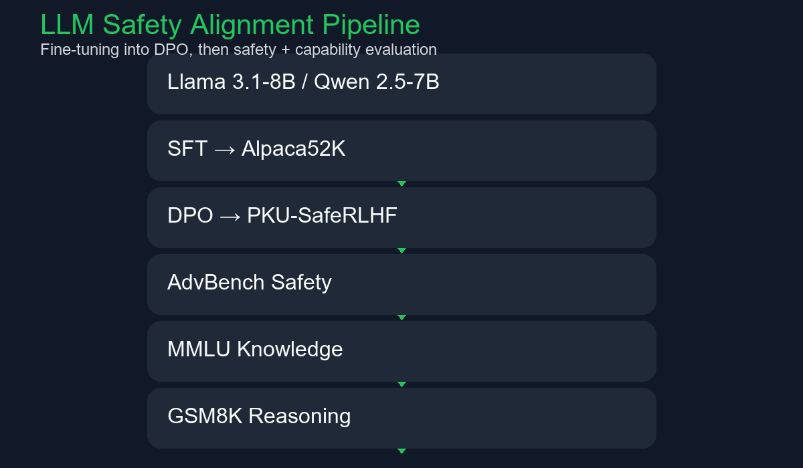
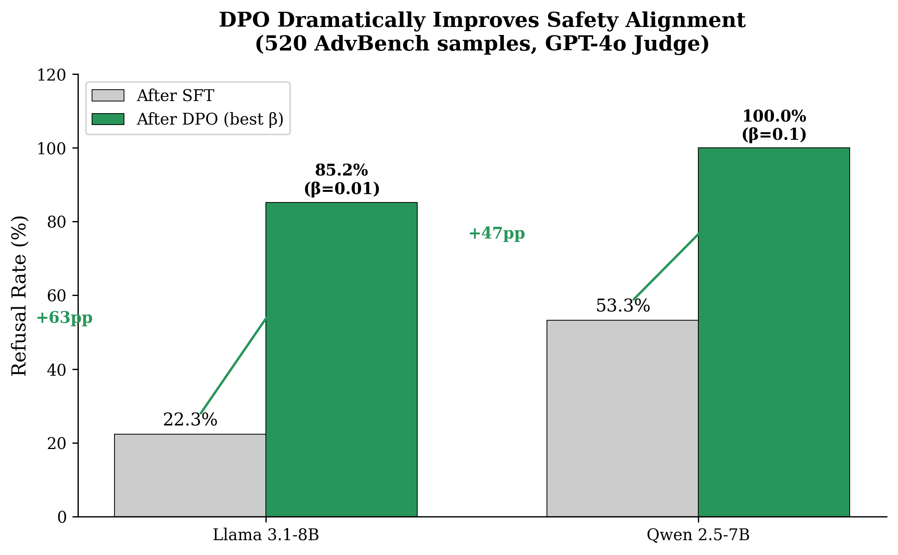
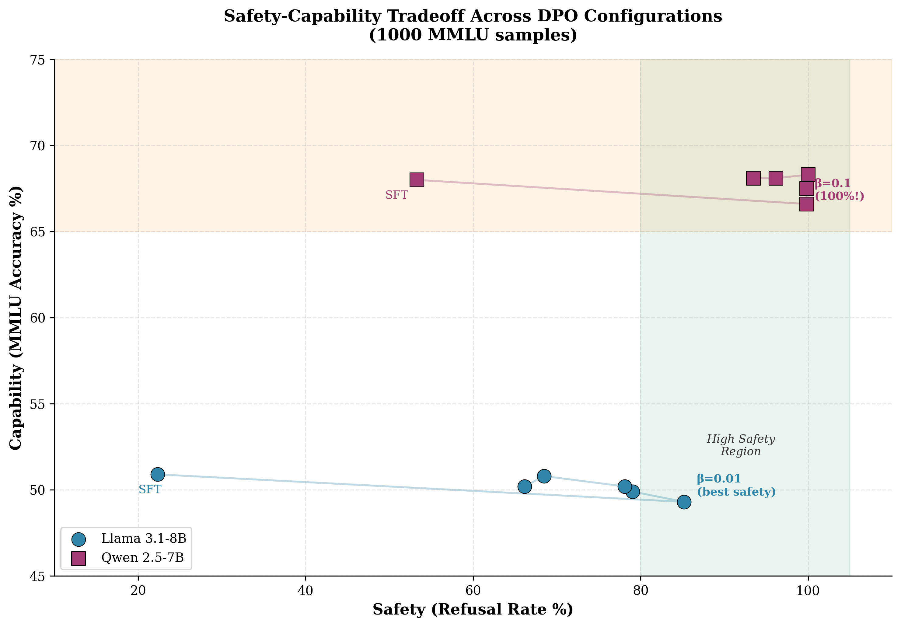
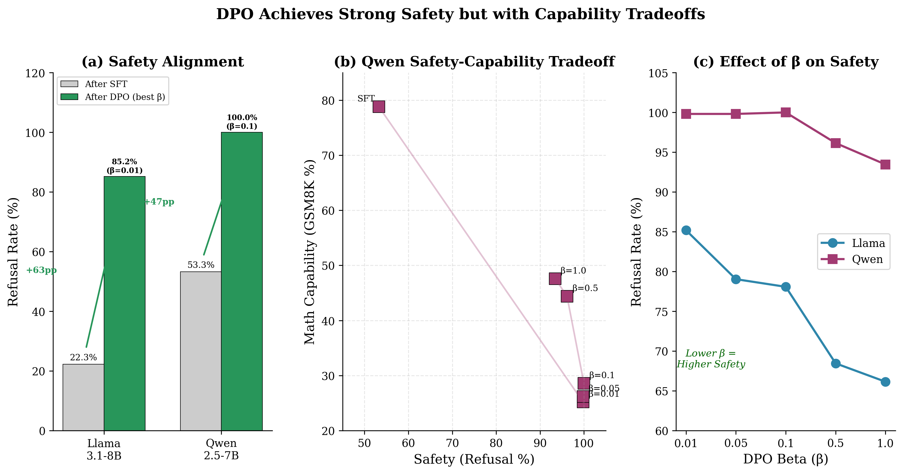

# LLM Safety & Alignment via Direct Preference Optimization (DPO)

## Project Overview

This portfolio project demonstrates how safety alignment via Direct Preference Optimization (DPO) impacts large language models, especially the tradeoff between safer responses and downstream capability.

The repository preserves original research code, experiment configuration, and evaluation pipelines for two production-scale models: **Llama 3.1 8B** and **Qwen 2.5 7B**.

## Motivation

Modern LLMs need to be both safe and capable. This project examines whether safety alignment creates a capability tax, and if that tradeoff is uniform across architectures.

## Research Question

Does safety alignment via DPO introduce a capability tax in large language models, and how does that tax manifest across safety, knowledge, and reasoning benchmarks?

## Methodology

The pipeline is:

- Start from a base LLM
- Apply supervised fine-tuning on Alpaca52K
- Apply DPO using PKU-SafeRLHF preference pairs
- Evaluate on safety and capability benchmarks

## Models Used

- **Llama 3.1 8B**
- **Qwen 2.5 7B**

## Datasets

- **Alpaca52K**: supervised fine-tuning data
- **PKU-SafeRLHF**: preference dataset for DPO calibration
- **AdvBench**: safety and refusal benchmark
- **MMLU**: general knowledge benchmark
- **GSM8K**: math reasoning benchmark

## Training Pipeline

The training flow is:

1. Base model
2. SFT with Alpaca52K
3. DPO with PKU-SafeRLHF
4. Safety evaluation on AdvBench
5. Knowledge evaluation on MMLU
6. Reasoning evaluation on GSM8K

## Evaluation Benchmarks

- **AdvBench**: measures safe refusal behavior
- **MMLU**: measures general knowledge retention
- **GSM8K**: measures reasoning and math capability

## Key Results

| Model | Training Stage | AdvBench Refusal | MMLU | GSM8K |
|-------|----------------|------------------|------|-------|
| Llama 3.1-8B | SFT | 22.3% | 50.9% | 12.4% |
| Llama 3.1-8B | DPO β=0.01 | 85.2% | 49.3% | 12.4% |
| Qwen 2.5-7B | SFT | 53.3% | 68.0% | 78.8% |
| Qwen 2.5-7B | DPO β=0.1 | 100.0% | 68.3% | 28.6% |

**Highlights:**

- DPO substantially improves safety alignment.
- MMLU remains largely stable under DPO.
- Qwen shows a significant GSM8K capability tax under aggressive safety tuning.

## Results Figures

## Repository Structure

- `configs/` — experiment configuration files for SFT and DPO on Llama and Qwen.
- `scripts/` — data preparation, evaluation, and figure generation code.
- `slurm/` — SLURM job scripts for training and evaluation on HPC clusters.
- `figures/` — portfolio-ready visual assets and the training pipeline diagram.
- `README.md` — portfolio documentation and project overview.

## Reproducibility

The repository preserves original experiment configs and pipeline scripts to support repeatable fine-tuning and evaluation.

### Reproduce Training

- Train with provided config files
- Use the same DPO β values as the paper: `0.01`, `0.05`, `0.1`, `0.5`, `1.0`

### Reproduce Evaluation

- Evaluate AdvBench with the GPT-4o judge pipeline
- Evaluate MMLU and GSM8K using the provided evaluation scripts

## Limitations

- The work requires high-memory GPU resources.
- Safety evaluation depends on an external LLM judge (GPT-4o).
- Results are specific to PKU-SafeRLHF and may not generalize to all safety datasets.

## Future Work

- Expand to additional model families and parameter scales
- Evaluate more safety, toxicity, and hallucination benchmarks
- Add end-to-end reproducibility automation
- Implement versioned data and model tracking

## Authors

- **Yahya Al Malallah** — AI Engineer, Machine Learning Engineer, Generative AI Engineer

---

## About This Repository

This project presents real-world LLM fine-tuning, DPO training, and safety-aware evaluation while preserving the original research experiments and conclusions.
